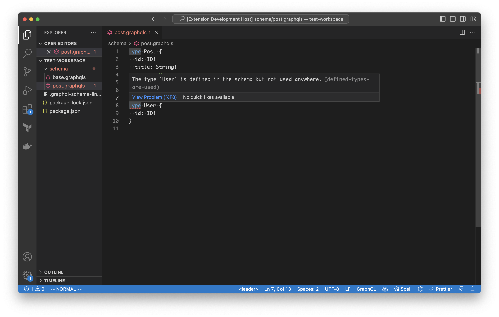

# Graphql Schema Linter for VSCode

This VSCode extension allows you to lint your GraphQL schema files using the [graphql-schema-linter](https://github.com/cjoudrey/graphql-schema-linter) library directly within the editor. The extension is activated when the graphql-schema-linter library is installed in your currently open workspace.



## Features

- Lint your GraphQL schema files in VSCode using the graphql-schema-linter library.
- Automatically runs linting when you save your schema files.
- Displays linting errors and warnings directly in the editor.

## Limitations

Please note that this extension does not support real-time linting as you make changes to your schema files. Linting is only performed when you save your files. This limitation is due to the difficulty of handling multiple schema files in real-time.

## Requirements

To use this extension, you must meet the following requirements:

- The graphql-schema-linter library must be installed in your currently open workspace. If you don't have it installed, you can install it as a dependency in your project:

```
npm install --save-dev graphql-schema-linter
```

- You must have the `schemaPaths` option configured in your graphql-schema-linter configuration file. This is necessary because the extension cannot determine whether a GraphQL file is a schema or a client query. See: https://github.com/cjoudrey/graphql-schema-linter#configuration-file

## Usage

Once the extension is installed and the graphql-schema-linter library is available in your workspace, the linting functionality will be automatically enabled. When you save your GraphQL schema files, the extension will run the linter and display any errors or warnings in the editor.

## No Configuration Needed

This extension does not require any configuration options. It automatically detects and uses the graphql-schema-linter library installed in your workspace.

## Feedback and Support

If you encounter any issues or have suggestions for improvements, please feel free to create an issue on the GitHub repository.

We appreciate your feedback and support in making this extension better for everyone!
